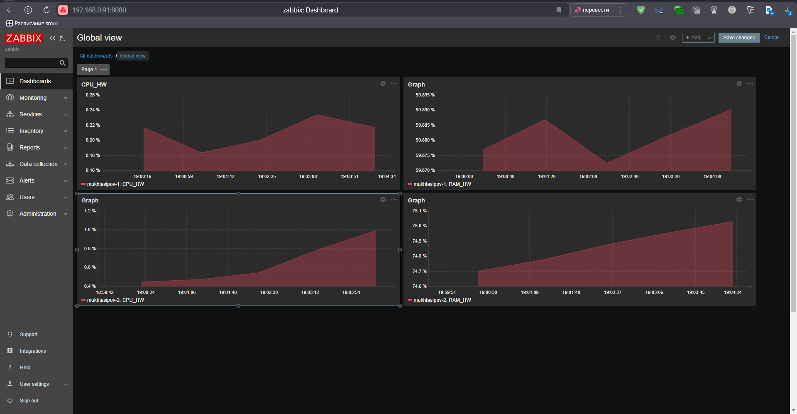

# Домашнее задание к занятию "`Prometheus. Часть 2`" - `Мухтасипов Александр`

### Инструкция по выполнению домашнего задания

###   Задание 1

Создайте файл с правилом оповещения, как в лекции, и добавьте его в конфиг Prometheus.

Требования к результату
 Погасите node exporter, стоящий на мониторинге, и прикрепите скриншот раздела оповещений Prometheus, где оповещение будет в статусе Pending

###   Задание 2
Установите Alertmanager и интегрируйте его с Prometheus.

Требования к результату
 Прикрепите скриншот Alerts из Prometheus, где правило оповещения будет в статусе Fireing, и скриншот из Alertmanager, где будет видно действующее правило оповещения

###   Задание 3
Задание 3
Активируйте экспортёр метрик в Docker и подключите его к Prometheus.

Требования к результату
 приложите скриншот браузера с открытым эндпоинтом, а также скриншот списка таргетов из интерфейса Prometheus.*

###  Задание 4* (со звездочкой)
Создайте свой дашборд Grafana с различными метриками Docker и сервера, на котором он стоит.

---
