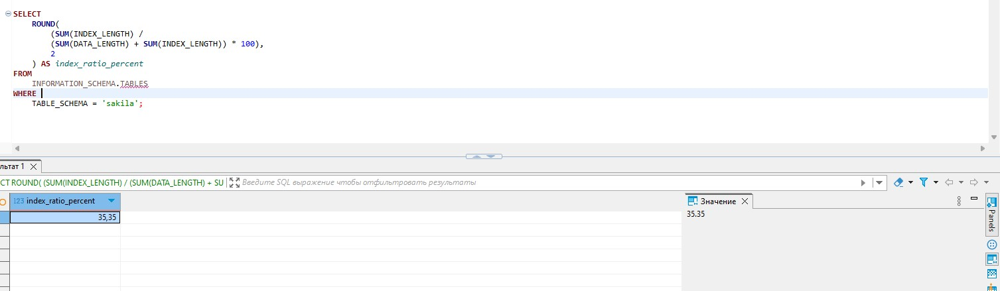
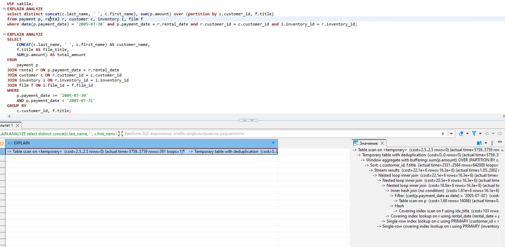
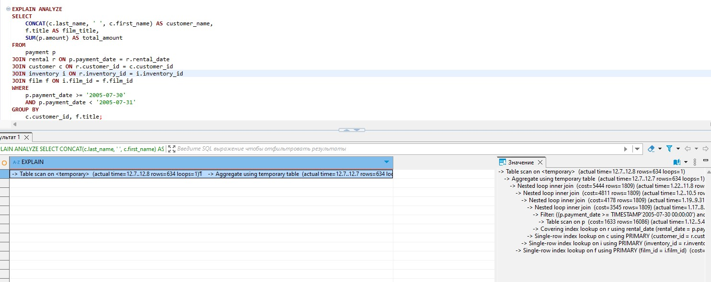

# Домашнее задание к занятию "`Индексы`" - `Мухтасипов Александр`


### Инструкция по выполнению домашнего задания

Задание 1
Напишите запрос к учебной базе данных, который вернёт процентное отношение общего размера всех индексов к общему размеру всех таблиц.

```
SELECT 
    ROUND(
        (SUM(INDEX_LENGTH) / 
        (SUM(DATA_LENGTH) + SUM(INDEX_LENGTH)) * 100), 
        2
    ) AS index_ratio_percent
FROM 
    INFORMATION_SCHEMA.TABLES 
WHERE 
    TABLE_SCHEMA = 'sakila';
```

.

Задание 2
Выполните explain analyze следующего запроса:

select distinct concat(c.last_name, ' ', c.first_name), sum(p.amount) over (partition by c.customer_id, f.title)
from payment p, rental r, customer c, inventory i, film f
where date(p.payment_date) = '2005-07-30' and p.payment_date = r.rental_date and r.customer_id = c.customer_id and i.inventory_id = r.inventory_id

.

перечислите узкие места;

Использование DATE(p.payment_date) в условии WHERE:
Функция DATE() не позволяет использовать индекс по payment_date, что приводит к полному сканированию таблицы payment.
Оконная функция SUM() OVER:
Оконные функции могут быть ресурсоёмкими, особенно при большом количестве строк и сложных условиях PARTITION BY.
Соединение таблиц:
Запрос соединяет 5 таблиц (payment, rental, customer, inventory, film), что может привести к временным таблицам и увеличению времени выполнения.
DISTINCT:
Устранение дубликатов после выполнения оконной функции может быть затратным.

оптимизируйте запрос: внесите корректировки по использованию операторов, при необходимости добавьте индексы.

```
EXPLAIN ANALYZE
SELECT 
    CONCAT(c.last_name, ' ', c.first_name) AS customer_name,
    f.title AS film_title,
    SUM(p.amount) AS total_amount
FROM 
    payment p
JOIN rental r ON p.payment_date = r.rental_date
JOIN customer c ON r.customer_id = c.customer_id
JOIN inventory i ON r.inventory_id = i.inventory_id
JOIN film f ON i.film_id = f.film_id
WHERE 
    p.payment_date >= '2005-07-30' 
    AND p.payment_date < '2005-07-31'
GROUP BY 
    c.customer_id, f.title;
```

.


---
