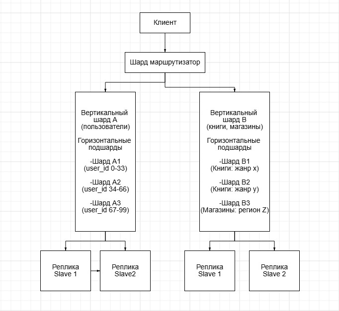

# Домашнее задание к занятию "`Репликация и масштабирование. Часть 2`" - `Мухтасипов Александр`

### Инструкция по выполнению домашнего задания

Задание 1
Опишите основные преимущества использования масштабирования методами:

активный master-сервер и пассивный репликационный slave-сервер;
master-сервер и несколько slave-серверов;
Дайте ответ в свободной форме.

Основные преимущества методов масштабирования:
1. Активный master-сервер и пассивный репликационный slave-сервер
Отказоустойчивость: Пассивный slave служит «горячей» резервной копией. При сбое master-сервера его можно быстро перевести в активный режим, минимизируя простой системы.

Резервное копирование: Slave-сервер можно использовать для создания бэкапов без нагрузки на master, что важно для критически важных данных.

Простота управления: Наличие только одного slave упрощает синхронизацию данных и конфигурацию по сравнению с множеством реплик.

Снижение нагрузки на master: Slave может обрабатывать часть запросов на чтение (если настроен на это), разгружая master, но основной акцент здесь — на резервирование, а не масштабирование.

2. Master-сервер и несколько slave-серверов
Масштабируемость чтения: Запросы на чтение распределяются между несколькими slave-серверами, что значительно повышает производительность при высокой read-нагрузке (например, в веб-приложениях с большим трафиком).

Повышенная отказоустойчивость: При выходе из строя одного slave остальные продолжают работать, обеспечивая стабильность системы.

Гибкость использования: Разные slave-серверы можно задействовать для специфических задач: аналитика, отчеты, тестирование — без влияния на основную базу (master).

Географическое распределение: Slave-серверы можно размещать в разных регионах, снижая задержку для пользователей и обеспечивая локальный доступ к данным.

Балансировка нагрузки: Технологии балансировки (например, Round Robin) автоматически распределяют запросы между slave-серверами, оптимизируя ресурсы.

Задание 2
Разработайте план для выполнения горизонтального и вертикального шаринга базы данных. База данных состоит из трёх таблиц:

пользователи,
книги,
магазины (столбцы произвольно).
Опишите принципы построения системы и их разграничение или разбивку между базами данных.

Пришлите блоксхему, где и что будет располагаться. Опишите, в каких режимах будут работать сервера.

Принципы построения системы
Вертикальный шардинг (разделение таблиц между серверами по функциональности):

Сервер A (Users Service): Таблица пользователи (частые операции записи/чтения, авторизация, профили).

Сервер B (Products Service): Таблицы книги и магазины (операции с каталогом, инвентаризацией, географическими данными).

Цель: Изоляция нагрузки, минимизация JOIN между разными серверами.

Горизонтальный шардинг (разделение данных внутри таблиц):

Пользователи:

Шардинг по user_id (например, хэш-распределение: user_id % 3).

Каждый шард хранит подмножество пользователей.

Книги:

Шардинг по жанру или автору (если запросы часто фильтруются по этим полям).

Магазины:

Шардинг по региону (географическое распределение для снижения задержки).

Репликация:

Каждый шард имеет реплики (мастер для записи, слейвы для чтения).

Реплики обеспечивают отказоустойчивость и балансировку нагрузки.

#.

Режимы работы серверов
Шард-маршрутизатор:

Определяет, на какой шард направить запрос (на основе ключа шардирования).

Использует правила для разделения:

Запросы к пользователи → Шард A.

Запросы к книги и магазины → Шард B.

Мастер-серверы:

Шард A1, A2, A3:

Режим: Read/Write для операций с пользователями.

Шард B1, B2, B3:

Режим: Read/Write для операций с книгами и магазинами.

Слейв-реплики:

Режим: Read-Only.

Используются для:

Выполнения аналитических запросов.

Резервного копирования.

Балансировки нагрузки чтения.

---