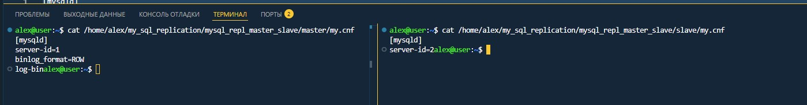
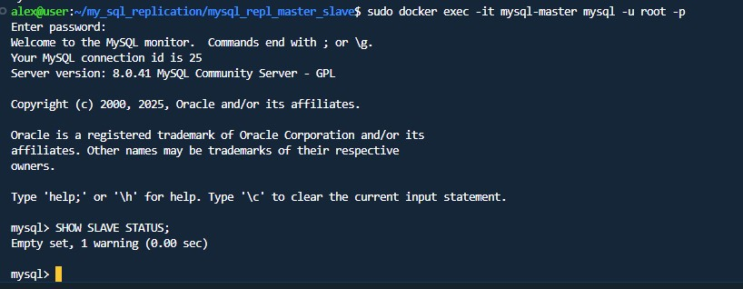
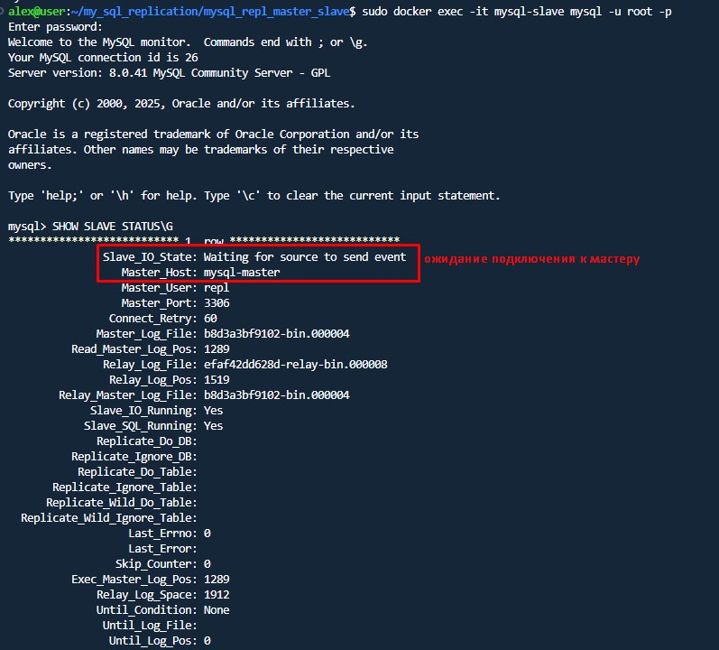
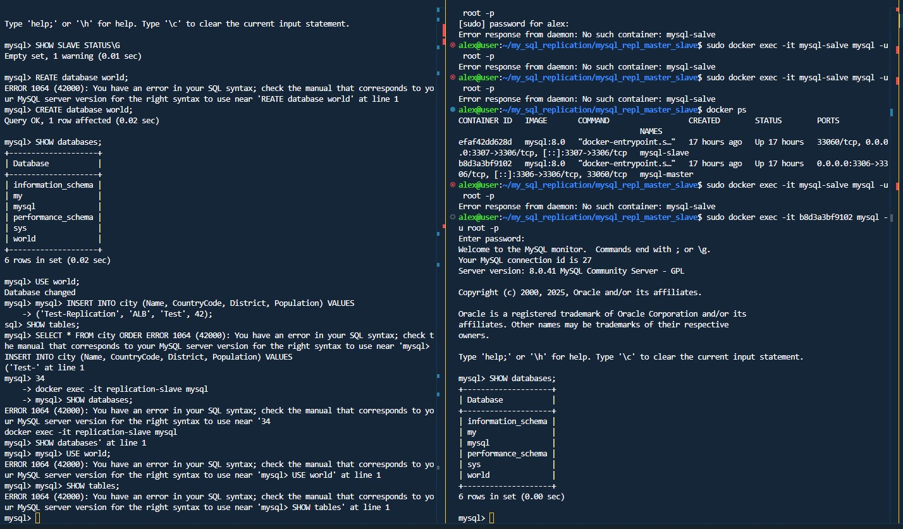

# Домашнее задание к занятию "`Репликация и масштабирование. Часть 1`" - `Мухтасипов Александр`

### Инструкция по выполнению домашнего задания

Задание 1
На лекции рассматривались режимы репликации master-slave, master-master, опишите их различия.

Ответить в свободной форме.

Различия между режимами репликации Master-Slave и Master-Master:

Направление репликации:

Master-Slave: Данные реплицируются только от мастера к слейву. Слейв доступен только для чтения, запись возможна только на мастер.

Master-Master: Оба сервера могут принимать запись и реплицировать изменения друг другу.

Отказоустойчивость:

Master-Slave: При падении мастера требуется ручное переключение на слейв (или использование оркестратора).

Master-Master: Автоматическое переключение возможно, но требуется контроль за конфликтами данных.

Нагрузка:

Master-Slave: Запись только на мастер, чтение можно распределить между мастером и слейвом.

Master-Master: Запись распределяется между серверами, что снижает нагрузку на отдельный узел.

Конфликты данных:

Master-Slave: Конфликты исключены, так как запись только на одном узле.

Master-Master: Возможны конфликты при одновременной записи одних данных на разных мастерах (требуются механизмы разрешения конфликтов).

Задание 2
Выполните конфигурацию master-slave репликации, примером можно пользоваться из лекции.

Приложите скриншоты конфигурации, выполнения работы: состояния и режимы работы серверов.

конфигурация
.

проверка режима работы на master сервере. При запросе slave статуса возвращает пустой ответ, значит сервер работает в master режиме.

.

проверка режима работы на slave сервере. При запросе slave статуса возвращает ответ c ожиданием ответа от мастера и именем мастера.

.

Создание базы world на мастере и репликация ее на slave

.
---
