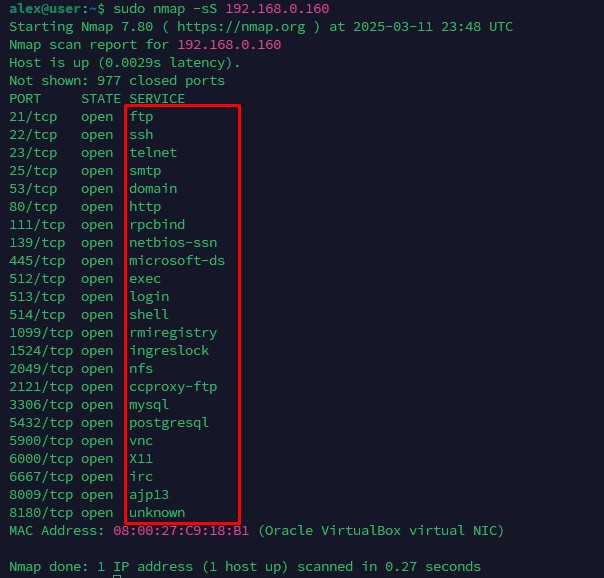
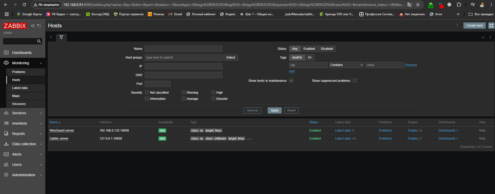
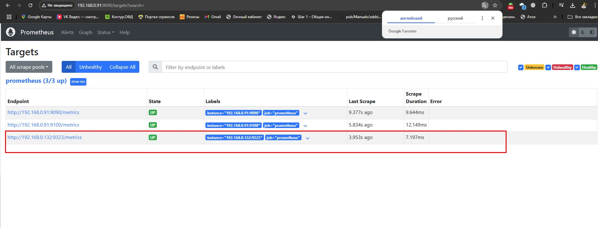
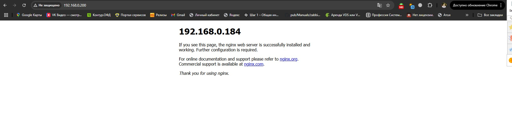

# Домашнее задание к занятию "`Система мониторинга Zabbix`" - `Мухтасипов Александр`


### Инструкция по выполнению домашнего задания

   Задание 1
Установите Zabbix Server с веб-интерфейсом.

Процесс выполнения
Выполняя ДЗ, сверяйтесь с процессом отражённым в записи лекции.
Установите PostgreSQL. Для установки достаточна та версия, что есть в системном репозитороии Debian 11.
Пользуясь конфигуратором команд с официального сайта, составьте набор команд для установки последней версии Zabbix с поддержкой PostgreSQL и Apache.
Выполните все необходимые команды для установки Zabbix Server и Zabbix Web Server.
Требования к результаты
Прикрепите в файл README.md скриншот авторизации в админке.
Приложите в файл README.md текст использованных команд в GitHub.



Команды:

```
$ sudo -s

# wget https://repo.zabbix.com/zabbix/6.4/ubuntu/pool/main/z/zabbix-release/zabbix-release_latest+ubuntu22.04_all.deb
# dpkg -i zabbix-release_latest+ubuntu22.04_all.deb
# apt update

# apt install zabbix-server-pgsql zabbix-frontend-php php8.1-pgsql zabbix-nginx-conf zabbix-sql-scripts zabbix-agent

# sudo -u postgres createuser --pwprompt zabbix
# sudo -u postgres createdb -O zabbix Zabbix

# zcat /usr/share/zabbix-sql-scripts/postgresql/server.sql.gz | sudo -u zabbix psql Zabbix

DBPassword=password

# listen 8080;
# server_name example.com;

# systemctl restart zabbix-server zabbix-agent nginx php8.1-fpm
# systemctl enable zabbix-server zabbix-agent nginx php8.1-fpm

sudo apt install nginx

sudo systemctl enable nginx
```
 
Задание 2
Установите Zabbix Agent на два хоста.

Процесс выполнения
Выполняя ДЗ, сверяйтесь с процессом отражённым в записи лекции.
Установите Zabbix Agent на 2 вирт.машины, одной из них может быть ваш Zabbix Server.
Добавьте Zabbix Server в список разрешенных серверов ваших Zabbix Agentов.
Добавьте Zabbix Agentов в раздел Configuration > Hosts вашего Zabbix Servera.
Проверьте, что в разделе Latest Data начали появляться данные с добавленных агентов.
Требования к результаты
Приложите в файл README.md скриншот раздела Configuration > Hosts, где видно, что агенты подключены к серверу
Приложите в файл README.md скриншот лога zabbix agent, где видно, что он работает с сервером
Приложите в файл README.md скриншот раздела Monitoring > Latest data для обоих хостов, где видны поступающие от агентов данные.
Приложите в файл README.md текст использованных команд в GitHub





```
sudo -s

# wget https://repo.zabbix.com/zabbix/6.4/ubuntu/pool/main/z/zabbix-release/zabbix-release_latest+ubuntu22.04_all.deb
# dpkg -i zabbix-release_latest+ubuntu22.04_all.deb
# apt update

# apt install zabbix-agent

# systemctl restart zabbix-agent
# systemctl enable zabbix-agent

tail -f /var/log/zabbix/zabbix_agentd.log смотреть лог агента

```


Задание 3 со звёздочкой*
Установите Zabbix Agent на Windows (компьютер) и подключите его к серверу Zabbix.

Требования к результаты
Приложите в файл README.md скриншот раздела Latest Data, где видно свободное место на диске C:

---
