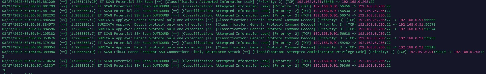

# **Домашнее задание к занятию "`Защита хоста`"** - `Мухтасипов Александр`

## Задание 1

Установите eCryptfs.
Добавьте пользователя cryptouser.
Зашифруйте домашний каталог пользователя с помощью eCryptfs.
В качестве ответа пришлите снимки экрана домашнего каталога пользователя с исходными и зашифрованными данными.

.

.

## Задание 2

Установите поддержку LUKS.
Создайте небольшой раздел, например, 100 Мб.
Зашифруйте созданный раздел с помощью LUKS.
В качестве ответа пришлите снимки экрана с поэтапным выполнением задания.

.

---