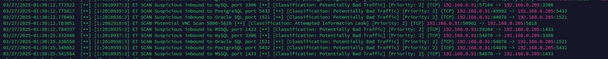

# **Домашнее задание к занятию "`Защита сети`"** - `Мухтасипов Александр`

## Задание 1

Проведите разведку системы и определите, какие сетевые службы запущены на защищаемой системе:

sudo nmap -sA < ip-адрес >

sudo nmap -sT < ip-адрес >

sudo nmap -sS < ip-адрес >

sudo nmap -sV < ip-адрес >

По желанию можете поэкспериментировать с опциями: https://nmap.org/man/ru/man-briefoptions.html.

В качестве ответа пришлите события, которые попали в логи Suricata и Fail2Ban, прокомментируйте результат.
.

Эти события соответствуют выполнению команд nmap -sA, -sT, -sS, -sV. Suricata корректно классифицировала их как Potentially Bad Traffic или Attempted Information Leak, что указывает на попытку разведки сети. 

Подозрительное сканирование портов:

Источник: 192.168.0.91 (система злоумышленника).

Назначение: 192.168.0.205 (защищаемая система).

Порты:

3306 (MySQL),

5432 (PostgreSQL),

1521 (Oracle SQL),

1433 (MSSQL),

5810 (VNC).

## Задание 2

Проведите атаку на подбор пароля для службы SSH:

hydra -L users.txt -P pass.txt < ip-адрес > ssh

Настройка hydra:
создайте два файла: users.txt и pass.txt;
в каждой строчке первого файла должны быть имена пользователей, второго — пароли. В нашем случае это могут быть случайные строки, но ради эксперимента можете добавить имя и пароль существующего пользователя.
Дополнительная информация по hydra: https://kali.tools/?p=1847.

Включение защиты SSH для Fail2Ban:
открыть файл /etc/fail2ban/jail.conf,
найти секцию ssh,
установить enabled в true.
Дополнительная информация по Fail2Ban:https://putty.org.ru/articles/fail2ban-ssh.html.

В качестве ответа пришлите события, которые попали в логи Suricata и Fail2Ban, прокомментируйте результат.

лог suricata
.

Suricata успешно обнаружила атаку Hydra, классифицировав её как брутфорс через правило ET SCAN LibSSH Based Frequent SSH Connections.

лог fail2ban
.

Из логов видно, что Fail2Ban успешно запустился и создал блокировку для защиты SSH:

Jail 'sshd' started — защита SSH активирована.

IP 192.168.0.91 обнаружен — Fail2Ban зафиксировал подозрительную активность с этого адреса.

---